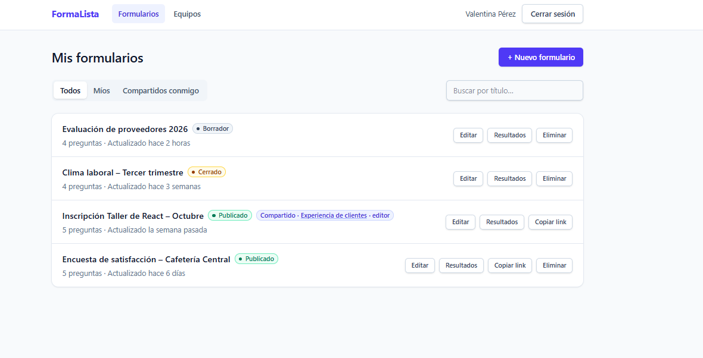
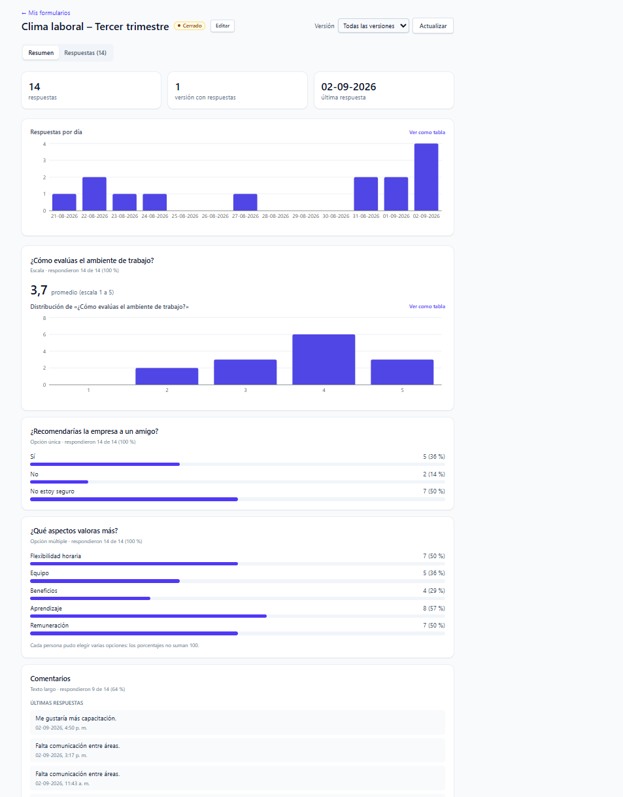
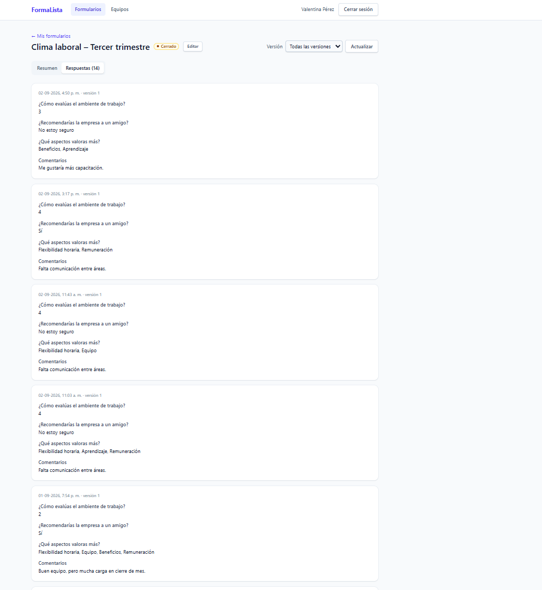
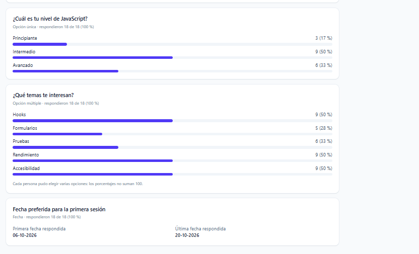
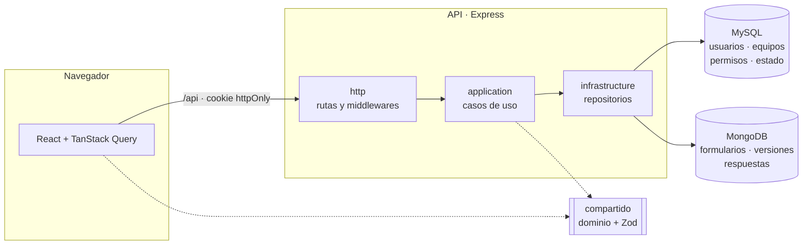
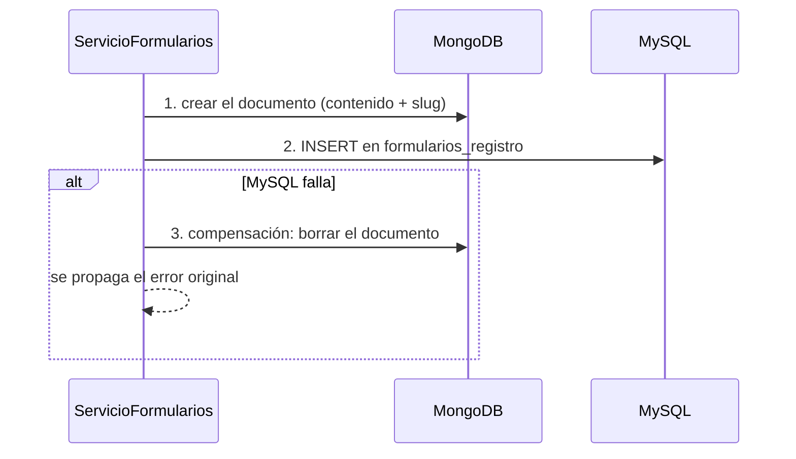

# FormaLista

[](https://github.com/lopezgalarce1997-debug/FormaLista/actions/workflows/ci.yml)
[](LICENSE)


**FormaLista** es una aplicación web para crear formularios y encuestas, publicarlos con un link y analizar las respuestas con gráficos. Los equipos colaboran con roles de propietario, editor y lector.

**Stack:** Node.js · Express · TypeScript · MySQL · MongoDB · React · TanStack Query · Tailwind CSS · Vitest · GitHub Actions.

**Destacado:** persistencia en dos bases de datos con compensación ante fallos, versionado de formularios con concurrencia optimista, estadísticas con agregaciones de MongoDB, interfaz accesible y **455 pruebas automatizadas** en integración continua.

## Contenido

- [Funcionalidades](#funcionalidades)
- [Capturas](#capturas)
- [Stack](#stack)
- [Arquitectura](#arquitectura)
- [Decisiones de diseño](#decisiones-de-diseño)
- [Ejecución local](#ejecución-local)
- [Pruebas e integración continua](#pruebas-e-integración-continua)
- [Rendimiento del frontend](#rendimiento-del-frontend)
- [API](#api)
- [Limitaciones y mejoras futuras](#limitaciones-y-mejoras-futuras)
- [Autor](#autor)
- [Licencia](#licencia)

## Funcionalidades

- **Editor de formularios** con seis tipos de pregunta: texto corto, texto largo, opción única, opción múltiple, escala y fecha. Permite preguntas obligatorias, reordenar, vista previa y aviso de cambios sin guardar.
- **Publicación con link público:** cualquiera responde sin registrarse, también desde el celular. El borrador se conserva si se recarga la página y los errores se muestran con un resumen accesible.
- **Resultados:** total de respuestas, respuestas por día, gráfico por pregunta, promedio de escalas y listado paginado de respuestas individuales, filtrables por versión.
- **Versionado:** editar un formulario publicado crea una versión nueva; cada respuesta se interpreta con las preguntas que tenía cuando se envió.
- **Edición concurrente segura:** si dos personas editan a la vez, la segunda recibe un aviso en vez de sobrescribir los cambios de la primera.
- **Equipos y roles:** un formulario se comparte con un equipo; el propietario gestiona los miembros y el rol de cada uno define qué puede hacer.
- **Seguridad:** sesión en cookie `httpOnly`, contraseñas con bcrypt, validación con Zod en cada entrada y límites de envío por IP.

## Capturas

**Mis formularios:** formularios propios en cada estado y uno compartido por un equipo.



| Resultados | Respuestas individuales |
|---|---|
|  |  |

**Opción múltiple y fechas:** porcentajes sobre quienes respondieron y rango de fechas elegidas.



## Stack

| Capa | Tecnología | Por qué |
|---|---|---|
| API | Node.js, Express 5, TypeScript | Errores asíncronos manejados por Express 5 y tipos compartidos con el frontend. |
| Datos relacionales | MySQL 8.4 con `mysql2` y **SQL escrito a mano** | Usuarios, equipos, permisos y estado necesitan relaciones, claves foráneas y transacciones. Sin ORM, para controlar cada consulta e índice. |
| Documentos | MongoDB 8 con Mongoose | Formularios de estructura variable, historial de versiones y agregaciones para las estadísticas. |
| Validación | Zod | El mismo esquema valida en la API y en los formularios del navegador. |
| Autenticación | JWT (`jose`, HS256) en cookie `httpOnly` + bcrypt | El token nunca queda accesible para JavaScript en el navegador. |
| Frontend | React 19, Vite, React Router, TanStack Query, React Hook Form, Tailwind CSS | Caché y revalidación de datos del servidor; formularios con validación compartida. |
| Gráficos | Recharts | Solo donde un gráfico aporta; cada uno va acompañado de una tabla accesible. |
| Pruebas | Vitest, Supertest, Testing Library, MSW, mongodb-memory-server | Unitarias sin bases de datos, e integración contra MySQL y MongoDB reales. |
| CI | GitHub Actions | Tipos, pruebas y build en cada push y pull request. |

## Arquitectura

Monorepo con **npm workspaces**:

```
FormaLista/
├── packages/compartido   # dominio y esquemas Zod: los usan la API y la web
├── api/                  # API REST (Express)
│   ├── migrations/       # scripts SQL numerados
│   └── src/
│       ├── http/            # rutas, middlewares (autenticación, validación, errores, límites)
│       ├── application/     # casos de uso (servicios) y puertos (interfaces de repositorios)
│       ├── infrastructure/  # repositorios MySQL y MongoDB, JWT, bcrypt
│       └── scripts/         # migrar, limpiar huérfanos, datos de ejemplo
└── web/                  # frontend React (Vite)
```

La API sigue una arquitectura por capas al estilo *Clean Architecture*. Los servicios reciben sus repositorios por el constructor (inyección de dependencias manual), así que se prueban con dobles sin bases de datos. Las reglas de negocio puras (validar una respuesta, qué permite cada rol, cómo combinar versiones en las estadísticas) viven en `packages/compartido` y **se ejecutan igual en el servidor y en el navegador**.



## Decisiones de diseño

### Reparto entre MySQL y MongoDB

| MySQL (estructura fija y relaciones) | MongoDB (estructura variable) |
|---|---|
| `usuarios`, `equipos`, `equipo_miembros` | `formularios`: título, preguntas, slug e historial de versiones |
| `formularios_registro`: propietario, equipo y estado (borrador, publicado o cerrado) | `respuestas`: versión respondida y valor de cada pregunta |

**MySQL es la fuente de verdad sobre la existencia y los permisos** de un formulario: si no hay registro en MySQL, el formulario no existe para nadie, aunque su documento siga en MongoDB. Las consultas de acceso usan `JOIN` sobre claves primarias compuestas, y el listado de formularios accesibles usa `UNION ALL` en lugar de un `OR` entre tablas para aprovechar los índices. MongoDB guarda lo que cambia de forma: cada tipo de pregunta tiene campos distintos y las respuestas se agregan con `$facet` en una sola consulta.

### Compensación entre las dos bases

No hay transacciones distribuidas entre MySQL y MongoDB, así que cada operación sigue un orden pensado para que un fallo parcial nunca deje un formulario visible a medias:



- **Crear:** primero MongoDB y después MySQL. Si MySQL falla, se borra el documento (acción compensatoria) y el cliente recibe el error original.
- **Eliminar:** primero el registro en MySQL. Desde ese instante el formulario deja de existir. Después se borran el contenido y las respuestas en MongoDB en paralelo. Si esa limpieza falla, la API responde `204` igual y registra el error.
- **Huérfanos:** si también falla la compensación, el documento queda sin registro e invisible. `npm run limpiar-huerfanos` borra los formularios huérfanos con más de 10 minutos de antigüedad y las respuestas cuyo formulario ya no existe.

Cada uno de estos fallos tiene su prueba, con repositorios simulados que fallan a propósito.

### Concurrencia optimista

Cada formulario tiene un número de `version`. Al guardar, el cliente envía la versión que estaba editando y MongoDB actualiza solo si sigue siendo la vigente, en una única operación atómica:

```js
// simplificado: el filtro incluye la versión que el cliente tenía abierta
findOneAndUpdate({ _id, version: versionEsperada }, { $set: cambios, $push: { versiones: anterior } })
```

Si otra persona guardó antes, la actualización no encuentra el documento y la API responde **`409 Conflict`**. La interfaz ofrece recargar la versión nueva o seguir editando para copiar los cambios, en vez de sobrescribir en silencio. Del mismo modo, los cambios de rol en un equipo se hacen en una transacción MySQL con `SELECT … FOR UPDATE`, de modo que dos cambios simultáneos nunca dejen un equipo sin propietario.

### Versionado de formularios

- Mientras el formulario está en **borrador**, las ediciones se aplican en el lugar.
- Una vez **publicado**, cambiar las preguntas archiva las anteriores en un historial dentro del mismo documento (`versiones`) y sube la versión. El historial se excluye de las lecturas normales mediante proyección.
- Cada respuesta guarda la versión con la que se envió y se valida contra **esas** preguntas, incluso si el formulario cambió mientras alguien lo respondía. En un formulario publicado no se permite cambiar el tipo de una pregunta existente.
- Las **estadísticas** combinan todas las versiones por defecto: las opciones eliminadas aparecen como "ya no existe", las escalas solo combinan versiones con el mismo rango (con una advertencia) y las preguntas eliminadas se muestran aparte. También se puede filtrar una versión concreta.

### Otras decisiones

- **Permisos:** sin acceso a un formulario, la API responde `404` para no revelar que existe; con acceso pero sin el rol necesario, responde `403`. La interfaz oculta las acciones no permitidas con la misma función del dominio que usa la API.
- **Sesión:** JWT en una cookie `httpOnly`, `SameSite=Strict` y `Secure` en producción; cerrar sesión borra la cookie. Tras iniciar sesión, la redirección se valida contra *open redirect*.
- **Límites de envío:** `express-rate-limit` por IP en el login, el registro y el formulario público; el del formulario público es configurable.
- **Accesibilidad:** errores asociados a cada campo (`aria-describedby`, `aria-invalid`), resumen de errores con enlaces al estilo GOV.UK, diálogos con `<dialog>` nativo, pestañas con teclado según WAI-ARIA, anuncios con `role="status"` y una tabla con los datos de cada gráfico.

## Ejecución local

**Requisitos:** Node.js 22 o superior, MySQL 8.4 y MongoDB 8.

1. **Clonar e instalar dependencias:**

   ```bash
   git clone https://github.com/lopezgalarce1997-debug/FormaLista.git
   cd FormaLista
   npm ci
   ```

2. **Crear las bases y el usuario de MySQL** (como `root`):

   ```sql
   CREATE DATABASE formalista CHARACTER SET utf8mb4 COLLATE utf8mb4_0900_ai_ci;
   CREATE DATABASE formalista_pruebas CHARACTER SET utf8mb4 COLLATE utf8mb4_0900_ai_ci;
   CREATE USER 'formalista'@'localhost' IDENTIFIED BY 'una-contraseña-segura';
   GRANT ALL PRIVILEGES ON formalista.* TO 'formalista'@'localhost';
   GRANT ALL PRIVILEGES ON formalista_pruebas.* TO 'formalista'@'localhost';
   ```

3. **Configurar la API:** copia `api/.env.example` como `api/.env` y completa `MYSQL_PASSWORD` y `JWT_SECRET`. El archivo de ejemplo incluye el comando para generar un secreto.

4. **Aplicar las migraciones y cargar datos de ejemplo:**

   ```bash
   npm run migrar
   npm run datos-ejemplo
   ```

5. **Iniciar la API y la web**, cada una en su propia terminal:

   ```bash
   npm run dev       # API en http://localhost:3000
   npm run dev:web   # web en http://localhost:5173
   ```

Entra en http://localhost:5173 con **`demo@example.com` / `demo12345`**.

| Script | Qué hace |
|---|---|
| `npm run dev` | API en modo *watch* |
| `npm run dev:web` | Web con Vite; las llamadas a `/api` pasan a la API por proxy |
| `npm run dev:web:red` | Igual que el anterior, visible en la red local (para probar desde el celular) |
| `npm run migrar` | Aplica las migraciones SQL pendientes |
| `npm run datos-ejemplo` | Crea tres cuentas de demostración, un equipo y cuatro formularios con respuestas; se puede repetir y solo reemplaza sus propios datos |
| `npm run limpiar-huerfanos` | Borra de MongoDB los formularios y respuestas sin registro en MySQL |
| `npm test` | Pruebas unitarias de los tres paquetes (sin bases de datos) |
| `npm run test:integracion` | Pruebas contra MySQL (`formalista_pruebas`) y MongoDB en memoria |
| `npm run build` | Compila el dominio compartido, la API y la web |

## Pruebas e integración continua

| Paquete | Tipo | Pruebas | Duración |
|---|---|---:|---:|
| `packages/compartido` | Unitarias: validación de respuestas, permisos, versionado y estadísticas | 167 | 0,4 s |
| `api` | Unitarias: servicios con dobles, compensación entre bases y endpoints con Supertest | 153 | 2,9 s |
| `web` | Componentes y flujos completos con Testing Library y MSW | 111 | 11,6 s |
| `api` | Integración: MySQL 8.4 real y MongoDB 8.2 en memoria | 24 | 2,1 s |
| **Total** | | **455** | |

- Las pruebas unitarias no necesitan bases de datos.
- Las de integración usan las migraciones reales y cubren, entre otros casos, la agregación de estadísticas, las consultas de acceso (con `EXPLAIN` para verificar los índices), el *rollback* de transacciones y dos cambios de rol simultáneos con `SELECT … FOR UPDATE`.
- Por seguridad, las pruebas de integración **se niegan a correr** si el nombre de la base no termina en `_pruebas`, porque vacían las tablas.

El workflow de [GitHub Actions](.github/workflows/ci.yml) corre en cada push y pull request con dos jobs en paralelo:

- **Tipos, pruebas unitarias y build**, en Node 22 y Node 24: 35 s cada uno.
- **Integración**, con MySQL 8.4 como contenedor de servicio y el binario de MongoDB en caché: 47 s.

> Todas las cifras de esta sección y de la siguiente provienen de la misma ejecución: [CI #36187729665](https://github.com/lopezgalarce1997-debug/FormaLista/actions/runs/36187729665).

## Rendimiento del frontend

Cada página es un archivo JavaScript que se descarga al visitarla (`React.lazy`). Tamaños del build de producción, sin comprimir y con gzip:

| Archivo | Tamaño | gzip | Cuándo se descarga |
|---|---:|---:|---|
| Carga inicial (React, router, TanStack Query, dominio) | 358 kB | 113 kB | Siempre |
| Página pública del formulario | 6 kB | 2 kB | Al abrir un link público |
| Validación de formularios (Zod + React Hook Form) | 130 kB | 39 kB | Al abrir una pantalla con formularios (login, registro, editor, equipos); la página pública no la necesita |
| Editor | 19 kB | 6 kB | Al editar |
| Resultados (incluye Recharts) | 371 kB | 108 kB | Solo al abrir los resultados |

Quien responde una encuesta desde el celular no descarga ni el editor, ni la validación de formularios, ni la librería de gráficos.

## API

| Método y ruta | Descripción |
|---|---|
| `POST /api/auth/registro` · `POST /api/auth/login` · `POST /api/auth/logout` · `GET /api/auth/yo` | Cuenta y sesión |
| `GET` · `POST /api/formularios` | Listar (propios y compartidos) y crear |
| `GET` · `PUT` · `DELETE /api/formularios/:id` | Ver, editar (exige `version`) y eliminar |
| `POST /api/formularios/:id/publicar` · `/cerrar` · `/compartir` | Cambiar el estado y compartir con un equipo |
| `GET /api/formularios/:id/resultados?version=&zona=` | Estadísticas, combinadas o de una versión |
| `GET /api/formularios/:id/respuestas?pagina=&tamano=&version=` | Respuestas individuales, paginadas |
| `GET /api/publico/:slug` · `POST /api/publico/:slug/respuestas` | Formulario público y envío de respuestas (sin sesión, con límite por IP) |
| `GET` · `POST /api/equipos` · `GET /api/equipos/:id` | Equipos del usuario, crear y ver detalle |
| `POST /api/equipos/:id/miembros` · `PATCH` · `DELETE /api/equipos/:id/miembros/:usuarioId` | Agregar miembros, cambiar su rol, quitarlos o salir del equipo |
| `GET /api/salud` | Estado de la API y de ambas bases de datos |

Los errores tienen siempre la forma `{ "error": "…", "detalles": [{ "campo": "…", "mensaje": "…" }] }`, así que la interfaz puede mostrar cada detalle bajo su campo. En [`api/requests.http`](api/requests.http) hay peticiones de ejemplo listas para usar con la extensión REST Client.

## Limitaciones y mejoras futuras

**Limitaciones conocidas**

- **Límites de envío en memoria.** Los contadores de `express-rate-limit` viven en la memoria del proceso. Con una sola instancia es suficiente, pero con varias detrás de un balanceador cada una contaría por separado. En ese escenario se usaría un almacén compartido como **Redis** (`rate-limit-redis`), sin cambiar el resto del código.
- **Varias personas pueden compartir una IP.** Quienes responden desde una misma red (una oficina, una sala de clases, una red móvil con NAT) comparten el contador. Por eso el límite de respuestas públicas es holgado (60 cada 15 minutos) y se ajusta con `LIMITE_RESPUESTAS_MAXIMO` y `LIMITE_RESPUESTAS_VENTANA_MINUTOS`. El del login (10 intentos fallidos cada 15 minutos) se mantiene estricto porque protege contra fuerza bruta.
- **Proxy inverso.** Detrás de un proxy habría que configurar `app.set('trust proxy', …)` para que Express lea la IP real del cliente.

**Mejoras futuras**

- **Arrastrar y soltar** para reordenar preguntas. Hoy se reordenan con botones ↑ ↓, accesibles con teclado.
- **Exportar las respuestas a CSV** desde la pantalla de resultados.
- **Renombrar y eliminar equipos.** El esquema ya define la regla: al borrar un equipo, `formularios_registro.equipo_id` pasa a `NULL` (`ON DELETE SET NULL`) y sus formularios vuelven a ser solo de su propietario.
- **Redis** para los límites de envío cuando haya varias instancias de la API.
- **Panel de resultados en Angular**, consumiendo la misma API.

## Autor

**Bladimir López**

- LinkedIn: [linkedin.com/in/bladimirlopez](https://www.linkedin.com/in/bladimirlopez)
- Portafolio: [bladimir-lopez.com](https://bladimir-lopez.com)

## Licencia

Distribuido bajo la licencia [MIT](LICENSE).
